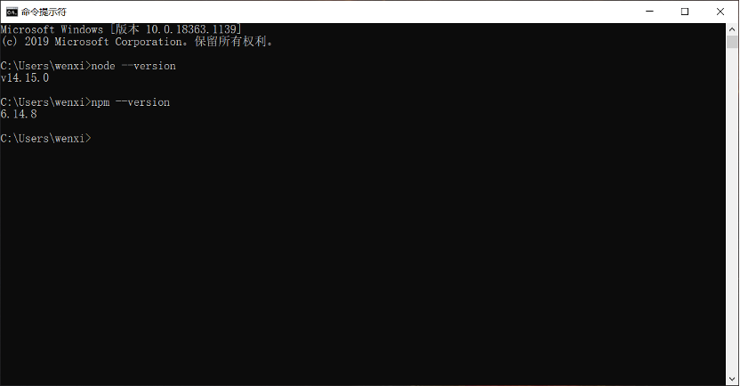
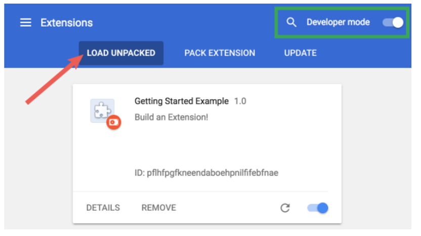
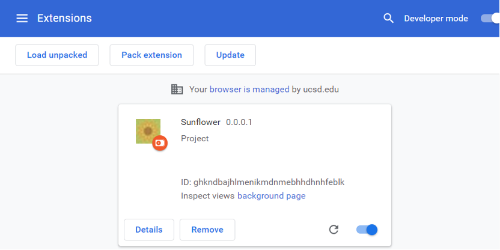

# Project_Sunflowers
CSE110 Project: Project Sunflowers

1.	Download Node.js

2.	To test that you have Node.js and npm correctly installed on your machine, you can type node --version and npm --version in a terminal or command prompt. You should be able to check your version.

3. git clone https://github.com/Wenxiao-Li/Project_Sunflowers

4. Open the Extension Management page by navigating to chrome://extensions. Enable Developer Mode by clicking the toggle switch next to Developer mode. Click the LOAD UNPACKED button and select the extension directory. You should see the extension appears.

 

In our case, it will be:
 

5. Future tests to JavaScripts: Navigate to the extension directory, and type npm start in your command line. You will be able to check your JavaScripts on http://localhost:3000.

