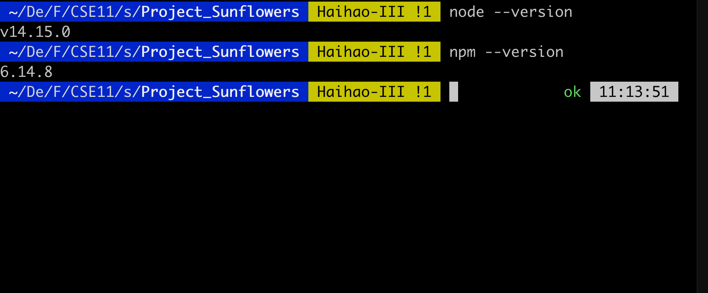

# Project_Sunflowers
CSE110 Project: Project Sunflowers

* This is a reworked project that use React.js as the framework

* This react reworked version is built from this 

  [boilerplate]: https://github.com/lxieyang/chrome-extension-boilerplate-react

## 1.	Download Node.js [link](https://nodejs.org/en/download/)

Ensure your Node.js version is >= **10.13**.

## 2.	To test that you have Node.js and npm correctly installed on your machine

you can type 
``` node --version ``` and ```npm --version``` in a terminal or command prompt. You should be able to check your version.

<br>



## 3. To Download the files from GitHub

```git clone https://github.com/Wenxiao-Li/Project_Sunflowers```

## 4. Install npm packages for project dependencies

Open command prompt in the project directory, and type

```npm install```

To install the dependencies for the project

* Note: you need to make sure **python2** is installed in your computer in order to install all the dependencies

## 5. How to run the project

Open command prompt in the project directory, and type

```npm start```

* Note: this project support **auto reload** feature that reloads the build automatically every time you save some file in your editor.

* Load your extension on Chrome following:

  1. Access `chrome://extensions/`
  2. Check `Developer mode`
  3. Click on `Load unpacked extension`
  4. 
  5. Select the `build` folder.
  6. 

* In order to see changes in content scripts or background.html, you need to **refresh the extension**.

* Note: you can run the dev mode on other port as well. Just specify the env var `port` like this:

  ```
  $ PORT=6002 npm run start
  ```


## 6. Structure

All your extension's code must be placed in the `src` folder.

The boilerplate is already prepared to have

* a popup, 
* an options page, 
* a background page, and 
* a new tab page (which replaces the new tab page of your browser). 
* home page (Note: this is something I added myself, and is **not part of the standard chrome extension layout, please check 7.2**)

Free free to customize these.

## 7. How to modify the project

### 7.1. Add assets/resources to the project

It seems like only the assets that been specified in the code will be copied to the ```build``` directory. Therefore, to ensure those files got successfully copied, you should include them in the background scripts: ```index.js``` under the Background directory (or maybe html I am not sure) like this:

```
import '../../assets/img/icon16.png';
import '../../assets/img/icon32.png';
import '../../assets/img/icon48.png';
import '../../assets/img/icon128.png';
import '../../assets/img/IMG_1277.jpg';
```

After running ```npm start```, you should confirm that those files are present under the ```build``` folder.

### 7.2. Add additional entries to the project (ie. home.html)

***Background information:*** A chrome extension generally has maximum five **entries**: ```popup.html```, ```options.html```, ```background.html```,```newtab.html ```,```content-scripts.js```, which **the original boilerplate has already included**. The React.js use webpack to convert its code into standard JavaScript to allow chrome extension to run the extension, however, by default, ```create-react-app``` only support one entry which is the ```index.html```, so to freshly build the project with React, you need to eject the dependencies out, config the webpack under ```webpack.config.js``` , which is done by the original boilerplate. The original boilerplate also does **custom directory parsing** in ```webpack.config.js``` , basically instructions on how to convert the project into the ```build``` directory. These are something that we need to do if we want to add additional entries (basically adding more html page in the build directory, if that's something we want).

To add ```home.html```:

1. create directory ```src/pages/Home```, and add ```home.html```, ```index.jsx``` under this directory

2. inside ```webpack.config.js``` add the script for home to entry like this:

   ```js
   {
     …
     entry: {
       newtab: path.join(__dirname, 'src', 'pages', 'Newtab', 'index.jsx'),
       options: path.join(__dirname, 'src', 'pages', 'Options', 'index.jsx'),
   	…
       home: path.join(__dirname, 'src', 'pages', 'Home', 'index.jsx')
     },
     …
     plugins: [
       …
       new HtmlWebpackPlugin({
         template: path.join(
           __dirname,
           'src',
           'pages',
           'Home',
           'home.html'
         ),
         filename: 'home.html',
         chunks: ['home'],
         cache: false,
       }),
       … 
     ]
   }
   ```

   **Caution: Although the home.html can be successfully redirected to and can be loaded in chrome under dev mode, I am not sure whether this will be successfully loaded after deployment** 

   **Caution: currently I have only used ```window.location.replace('./home.html');``` as well as ```<a href="home.html"></a>``` to redirect pages, only a few attempts using the Router in ```'react-router-dom'``` is successful, partially due to my inexperience with them. There are suggestions online about how to use them in chrome-extension, can could be tried out in the future.


### 7.3. Add Content Scripts

Although this boilerplate uses the webpack dev server, it's also prepared to write all your bundles files on the disk at every code change, so you can point, on your extension manifest, to your bundles that you want to use as [content scripts](https://developer.chrome.com/extensions/content_scripts), but you need to exclude these entry points from hot reloading [(why?)](https://github.com/samuelsimoes/chrome-extension-webpack-boilerplate/issues/4#issuecomment-261788690). To do so you need to expose which entry points are content scripts on the `webpack.config.js` using the `chromeExtensionBoilerplate -> notHotReload` config. Look the example below.

Let's say that you want use the `myContentScript` entry point as content script, so on your `webpack.config.js` you will configure the entry point and exclude it from hot reloading, like this:

```js
{
  …
  entry: {
    myContentScript: "./src/js/myContentScript.js"
  },
  chromeExtensionBoilerplate: {
    notHotReload: ["myContentScript"]
  }
  …
}
```

and on your `src/manifest.json`:

```json
{
  "content_scripts": [
    {
      "matches": ["https://www.google.com/*"],
      "js": ["myContentScript.bundle.js"]
    }
  ]
}
```

## 8. Packing

After the development of your extension run the command

```
$ NODE_ENV=production npm run build
```

Now, the content of `build` folder will be the extension ready to be submitted to the Chrome Web Store. Just take a look at the [official guide](https://developer.chrome.com/webstore/publish) to more infos about publishing.

## 9. Secrets

If you are developing an extension that talks with some API you probably are using different keys for testing and production. Is a good practice you not commit your secret keys and expose to anyone that have access to the repository.

To this task this boilerplate import the file `./secrets.<THE-NODE_ENV>.js` on your modules through the module named as `secrets`, so you can do things like this:

_./secrets.development.js_

```js
export default { key: '123' };
```

_./src/popup.js_

```js
import secrets from 'secrets';
ApiCall({ key: secrets.key });
```

:point_right: The files with name `secrets.*.js` already are ignored on the repository.

## 10. Resources:

- [Webpack documentation](https://webpack.js.org/concepts/)
- [Chrome Extension documentation](https://developer.chrome.com/extensions/getstarted)

